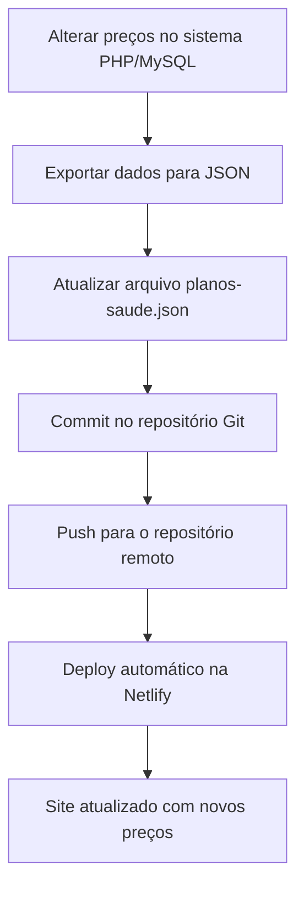

# Plano de Migração: Tabela de Preços de Planos de Saúde

## Visão Geral
Este documento detalha o plano para migrar a tabela de preços dinâmica de planos de saúde de uma implementação PHP/MySQL para uma abordagem estática baseada em dados locais no projeto Astro.

## Contexto Atual
- **Sistema Legado**: Tabela de preços dinâmica alimentada por API PHP/MySQL
- **Projeto Atual**: Site estático em Astro com componente `TabelaPrecos.astro`
- **Desafio**: Migrar para dados locais sem perder funcionalidade

## Estrutura de Dados Proposta

### Arquivo: `src/data/planos-saude.json`
```json
{
  "planos": [
    {
      "id": 1,
      "nome": "Plano Básico",
      "descricao": "Cobertura essencial para seu pet",
      "precos": [
        {
          "especie": "cão",
          "porte": "pequeno",
          "faixaEtaria": "ate_6_meses",
          "preco": 29.90,
          "adesao": 49.90
        },
        {
          "especie": "cão",
          "porte": "pequeno",
          "faixaEtaria": "7_meses_a_2_anos",
          "preco": 39.90,
          "adesao": 49.90
        }
        // ... mais preços
      ],
      "beneficios": [
        "Cobertura básica",
        "Atendimento 24h",
        "Rede credenciada"
      ]
    }
    // ... mais planos
  ]
}
```

## Modificações no Componente Astro

### Componente: `src/components/TabelaPrecos.astro`
```astro
---
// Importar dados locais
import planosData from '@/data/planos-saude.json';

// Agrupar dados por espécie
const planosPorEspecie = planosData.planos.reduce((acc, plano) => {
  plano.precos.forEach(preco => {
    if (!acc[preco.especie]) {
      acc[preco.especie] = [];
    }
    acc[preco.especie].push({
      ...plano,
      preco: preco.preco,
      adesao: preco.adesao,
      porte: preco.porte,
      faixaEtaria: preco.faixaEtaria
    });
  });
  return acc;
}, {});

// Obter espécies únicas
const especies = Object.keys(planosPorEspecie);
---

<div class="container mx-auto px-4 py-8">
  <!-- Tabs para seleção de espécie -->
  <div class="flex border-b border-gray-200 mb-6">
    {especies.map(especie => (
      <button 
        class={`px-4 py-2 font-medium ${especie === especieSelecionada ? 'text-blue-600 border-b-2 border-blue-600' : 'text-gray-500 hover:text-gray-700'}`}
        onclick={`selecionarEspecie('${especie}')`}
      >
        {especie === 'cão' ? 'Cães' : especie === 'gato' ? 'Gatos' : especie}
      </button>
    ))}
  </div>

  <!-- Tabela de preços -->
  <div class="overflow-x-auto">
    <table class="min-w-full bg-white border border-gray-200">
      <thead>
        <tr class="bg-gray-50">
          <th class="px-6 py-3 text-left text-xs font-medium text-gray-500 uppercase tracking-wider">Plano</th>
          <th class="px-6 py-3 text-left text-xs font-medium text-gray-500 uppercase tracking-wider">Porte</th>
          <th class="px-6 py-3 text-left text-xs font-medium text-gray-500 uppercase tracking-wider">Faixa Etária</th>
          <th class="px-6 py-3 text-left text-xs font-medium text-gray-500 uppercase tracking-wider">Mensalidade</th>
          <th class="px-6 py-3 text-left text-xs font-medium text-gray-500 uppercase tracking-wider">Adesão</th>
        </tr>
      </thead>
      <tbody class="bg-white divide-y divide-gray-200">
        {planosPorEspecie[especieSelecionada]?.map((plano, index) => (
          <tr key={index} class="hover:bg-gray-50">
            <td class="px-6 py-4 whitespace-nowrap">
              <div class="text-sm font-medium text-gray-900">{plano.nome}</div>
              <div class="text-sm text-gray-500">{plano.descricao}</div>
            </td>
            <td class="px-6 py-4 whitespace-nowrap text-sm text-gray-500">
              {plano.porte === 'pequeno' ? 'Pequeno' : plano.porte === 'medio' ? 'Médio' : 'Grande'}
            </td>
            <td class="px-6 py-4 whitespace-nowrap text-sm text-gray-500">
              {plano.faixaEtaria === 'ate_6_meses' ? 'Até 6 meses' : 
               plano.faixaEtaria === '7_meses_a_2_anos' ? '7 meses a 2 anos' :
               plano.faixaEtaria === '3_a_5_anos' ? '3 a 5 anos' :
               plano.faixaEtaria === '6_a_8_anos' ? '6 a 8 anos' : 'Acima de 8 anos'}
            </td>
            <td class="px-6 py-4 whitespace-nowrap text-sm font-medium text-gray-900">
              R$ {plano.preco.toFixed(2)}
            </td>
            <td class="px-6 py-4 whitespace-nowrap text-sm font-medium text-gray-900">
              R$ {plano.adesao.toFixed(2)}
            </td>
          </tr>
        ))}
      </tbody>
    </table>
  </div>
</div>

<script>
  let especieSelecionada = 'cão';
  
  function selecionarEspecie(especie) {
    especieSelecionada = especie;
    // Atualizar UI
    document.querySelectorAll('button[onclick^="selecionarEspecie"]').forEach(btn => {
      btn.classList.remove('text-blue-600', 'border-b-2', 'border-blue-600');
      btn.classList.add('text-gray-500', 'hover:text-gray-700');
    });
    event.target.classList.remove('text-gray-500', 'hover:text-gray-700');
    event.target.classList.add('text-blue-600', 'border-b-2', 'border-blue-600');
  }
</script>
```

## Processo de Atualização Manual

### Fluxo de Atualização


### Passos Detalhados
1. **Exportar dados do sistema legado**:
   - Acessar o sistema PHP/MySQL
   - Realizar as alterações necessárias nos preços
   - Exportar os dados atualizados para formato JSON

2. **Atualizar arquivo local**:
   - Copiar o JSON exportado para `larcompet-site/src/data/planos-saude.json`
   - Validar a estrutura do JSON
   - Testar localmente para garantir que os dados são exibidos corretamente

3. **Commit e deploy**:
   ```bash
   cd larcompet-site
   git add src/data/planos-saude.json
   git commit -m "Atualização de preços dos planos de saúde"
   git push origin main
   ```

4. **Verificação**:
   - Aguardar o deploy automático na Netlify
   - Acessar o site e verificar se os preços foram atualizados corretamente

## Benefícios da Migração

1. **Performance**: Carregamento mais rápido sem requisições dinâmicas
2. **Simplicidade**: Menos dependências e pontos de falha
3. **Controle**: Versionamento completo dos dados no Git
4. **Segurança**: Sem exposição direta do banco de dados
5. **Custo**: Redução de recursos de servidor

## Próximos Passos

1. **Implementação inicial**:
   - Criar o arquivo `src/data/planos-saude.json` com dados de exemplo
   - Modificar o componente `TabelaPrecos.astro` para usar dados locais
   - Testar a funcionalidade

2. **Documentação**:
   - Criar um guia para o processo de atualização manual
   - Documentar a estrutura de dados esperada

3. **Melhorias futuras**:
   - Desenvolver um script de exportação automático
   - Considerar automação via webhooks se necessário

## Considerações

- Este plano assume que as atualizações de preço não são frequentes
- O processo manual é simples e eficaz para atualizações esporádicas
- A abordagem pode ser evoluída para automação conforme a necessidade
- Manter o sistema legado como fonte de verdade para os dados