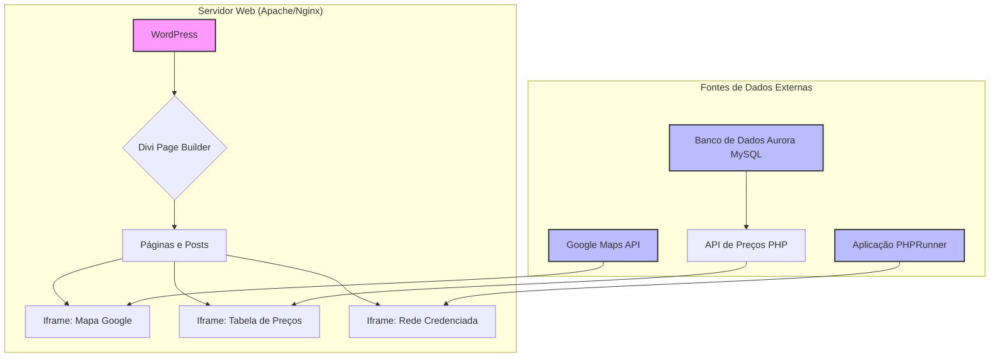

# Padrões de Sistema: LarcomPet (Sistema Atual)

## 1. Arquitetura Geral

A arquitetura atual é baseada em um monólito de **WordPress**, utilizando o construtor de páginas **Divi** para a criação do layout e da interface. O conteúdo dinâmico é injetado na página através de **iframes**, que carregam aplicações independentes.

## 2. Padrões de Design (e Anti-Padrões)

*   **Anti-Padrão: Injeção de Conteúdo via Iframe:**
    *   **Descrição:** A principal estratégia para exibir conteúdo dinâmico (preços, mapas, listas) é o uso de iframes. Cada iframe carrega um documento HTML completamente separado, com seus próprios recursos (CSS, JS).
    *   **Consequências:**
        *   **Bloqueio de Renderização:** O navegador precisa esperar o carregamento do conteúdo de múltiplos domínios e recursos, o que degrada drasticamente o LCP (Largest Contentful Paint).
        *   **Acoplamento Fraco, Integração Ruim:** Embora desacople o desenvolvimento, a integração visual e funcional é pobre. Não há comunicação direta entre a página principal e o conteúdo do iframe.
        *   **Sobrecarga de Requisições:** Multiplica o número de requisições HTTP, CSS e JS, impactando a performance geral.

*   **Padrão: Monólito com Construtor de Páginas (Page Builder):**
    *   **Descrição:** O uso do Divi permite a criação de layouts complexos sem a necessidade de codificação direta, o que agiliza o desenvolvimento inicial.
    *   **Consequências:**
        *   **Código Gerado (Bloat):** Construtores de página tendem a gerar HTML e CSS excessivos e, por vezes, ineficientes, aumentando o tamanho do DOM e o tempo de processamento.
        *   **Excesso de JavaScript:** Carrega múltiplos scripts para funcionalidades visuais (animações, sliders, etc.), muitos dos quais podem não ser utilizados, contribuindo para o Total Blocking Time (TBT).
        *   **Dificuldade de Otimização Fina:** É difícil otimizar o código gerado pelo construtor, limitando as possibilidades de melhoria de performance.

## 3. Caminhos Críticos de Implementação

*   **Carregamento da Tabela de Preços:** A funcionalidade mais crítica para a conversão depende de uma cadeia de eventos lenta: a página principal carrega, o iframe da tabela de preços carrega, e este por sua vez faz uma chamada a uma API PHP para buscar os dados no Aurora MySQL. Qualquer falha ou lentidão em um desses passos impede o usuário de ver os preços.
*   **Carregamento da Rede Credenciada:** Similar à tabela de preços, depende de um iframe que carrega uma aplicação externa (PHPRunner), criando um ponto único de falha e lentidão.